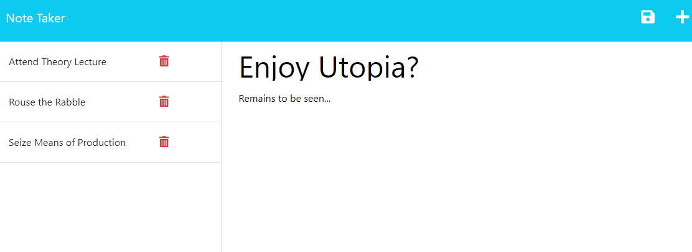

# Note Taker (Express) (Bootcamp Challenge 11)

## Introduction and Purpose:

I used this exercise as an opportunity to practice handling routes within the Express.js framework, and also to familiarise myself with Heroku. The front-end was pre-supplied, and my task was to create the back-end functionality.

## Scenario:

A fictional businessperson wishes for a note taking web application to aid in personal organisation.

## Technical Overview:

The application presents a landing page as the global default for the entire domain. The landing page has a link to the note management interface. The server I wrote handles GET, POST, and DELETE requests for note headings and contents, assigns unique ids to the and stores them in a persistent back-end database.

## Dependencies:

The application uses Express.js 4.16.4 and [uniqid 5.4](github.com/adamhalasz/uniqid/) by Adam Halasz to generate unique ids for the notes.

## Results:

The application is currently live on [Heroku](https://note-taker-express-29.herokuapp.com/) 

The GitHub repository for the project is: https://github.com/tadcos29/note-taker-express/
